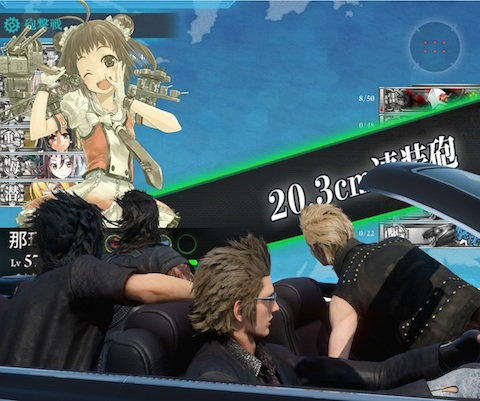
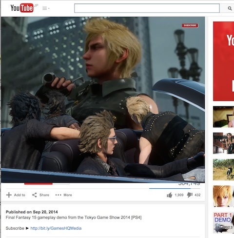

# ホスト拡張

* キャプチャを撮るだけで簡単にクソコラが作れます
* 高級車気分が味わえます
* 一人で動画を見ていて寂しくなったときになんとなく賑やかになります
* サファリには対応していません

## インストール方法

1. どこか適当な場所にダウンロードします (Download ZIPを押す、もしくはGitがわかればcloneする)
2. URL欄に chrome://extensions と入れてください。拡張インストール画面が開きます
3. 右上の "Developer Mode" にチェックを入れます
4. "Load Unpacked Extension..." ボタンを押します

## 使い方

* ツールバーにあるアイコンをクリックします
* 3種類の中から好きな画像をクリックすると、ブラウザ内に高級車を召喚できます
* 高級車はドラッグできます。好きな場所に配置してください
* 左上のスライダー (マウスオーバーすると出ます)でサイズを調整できます

## ネタ

* [FINAL FANTASY XV TGS 2014 TRAILER @YouTube](https://www.youtube.com/watch?v=wT3dyanB3pk)

* [FF公式アカウントで配布されたコラ素材1](https://twitter.com/FF25TH_JP/status/517652468084142080)
* [FF公式アカウントで配布されたコラ素材2](https://twitter.com/FF25TH_JP/status/517652546303692800)
* [FF公式アカウントで配布されたコラ素材3](https://twitter.com/FF25TH_JP/status/517652717745864704)

* [Final Fantasy XV 公式サイト](http://www.jp.square-enix.com/ff15/)

## この拡張の画像以外の部分の作者

ごうだまりぽ ( [Twitter](https://twitter.com/MaripoGoda) / [Blog](http://blog.maripo.org/) )